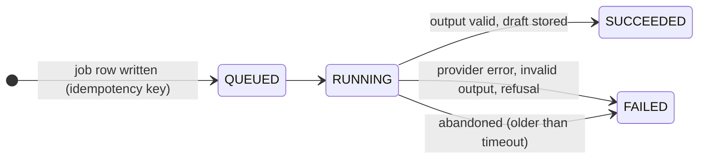
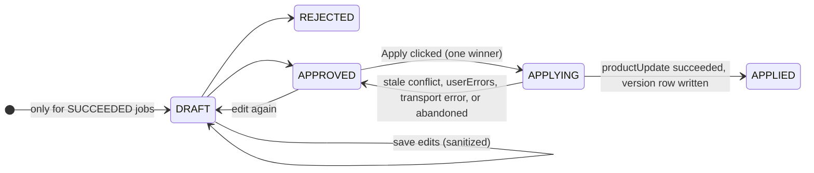

# Design decisions — Merchant Product Enrichment Hub

One section per part of the app: **what** was built, **why**, and the **alternatives** considered. How each folder works today is in that folder's `README.md`; what has been verified is in [VERIFICATION.md](VERIFICATION.md).

1. [Database, install lifecycle and tenant context](#1-database-install-lifecycle-and-tenant-context)
2. [Product sync](#2-product-sync-shopify-admin-graphql--mysql)
3. [Product search and badge editor](#3-product-search-and-badge-editor)
4. [Product webhooks](#4-product-webhooks-and-idempotent-receipts)
5. [Developer API](#5-developer-api-apiv1-and-api-keys)
6. [Storefront badge](#6-app-proxy-and-the-product-badge-theme-block)
7. [AI product description generator](#7-ai-product-description-generator) (design, implementation in progress)

---

## 1. Database, install lifecycle and tenant context

### 1. `docker-compose.yml` + `docker/mysql-init.sql`
- Runs MySQL 8.0 in a container on host port **3307** (container port 3306). 3307 avoids clashing with any other MySQL already using 3306 on the machine.
- `volumes: mysql-data` → data survives container restarts.
- `healthcheck` → lets us wait until MySQL actually accepts connections.
- `mysql-init.sql` runs only the *first* time the volume is created: it creates a test DB and grants the `app` user permission to create databases. Prisma's `migrate dev` needs that to build a temporary **shadow database**, which it uses to detect schema drift.
- **Alternatives:** Homebrew MySQL (no Docker, but setup differs per machine), or a hosted DB like PlanetScale or RDS (needs internet and accounts). Docker gives reviewers a one-command setup, which the assignment asks for (30-minute setup).

### 2. `.env` / `.env.example`
- `DATABASE_URL` tells Prisma where MySQL is. `.env` is git-ignored (secrets never get committed); `.env.example` has placeholders and *is* committed. We added `!.env.example` to `.gitignore` because the template ignored `.env.*`.
- Shopify keys are not in `.env`: `shopify app dev` injects `SHOPIFY_API_KEY`, `SHOPIFY_API_SECRET` and `SCOPES` at runtime from your Partner app.

### 3. `db/schema.prisma`
**Prisma** is an ORM: the tables are described once, and it generates (a) SQL migrations and (b) a typed client (`db.product.findMany(...)`).
- `provider = "mysql"` was `"sqlite"`. The assignment rejects SQLite.
- We deleted the old SQLite migration: migrations are database-specific, so we started fresh with `db/migrations/<timestamp>_init_mysql_schema/migration.sql`. That file is the real SQL (CREATE TABLE, UNIQUE, INDEX, FOREIGN KEY).
- `@@map("products")` → code uses `Product`, and the MySQL table is named `products` (snake_case, as the assignment names them).

Model by model:
| Model | Key design choice | Why |
|---|---|---|
| `Session` → `shop_sessions` | Field names unchanged; `accessToken @db.Text` | Shopify's `PrismaSessionStorage` reads and writes this table by those exact names. In MySQL a plain `String` is VARCHAR(191), too short for tokens, so we use TEXT. |
| `Shop` | `shopDomain @unique`, `uninstalledAt` nullable | One row per store = the **tenant**. `uninstalledAt = null` means installed. We don't delete the row on uninstall, so history and reinstall stay simple. |
| `Product` | `@@unique([shopId, shopifyProductGid])` | The DB itself refuses duplicates, so a re-sync can only update. Scoped by shop, so two shops can't collide. |
| | `shopifyProductGid String` | Shopify IDs look like `gid://shopify/Product/123`. They're strings, not our numeric IDs (an explicit assignment rule). |
| | `@@index([shopId, title])`, `([shopId, status])` | Fast search/filter *within one shop*. Every query starts with `shopId`, so it's the first column. |
| | `deletedAt` (soft delete) | When Shopify deletes a product we mark it deleted instead of removing it, so its enrichment isn't lost silently and we keep an audit trail. |
| `Variant` | `shopifyVariantGid @unique`, `price Decimal(12,2)` | Never use float for money (rounding errors). Cascade-deletes with its product. |
| `ProductEnrichment` | `productId @unique` | Enforces "one enrichment per product" in the DB. The sync never writes this table → **enrichments survive re-sync** (data ownership rule). `internalNote` is private. |
| `WebhookReceipt` | `webhookId @unique` + `status` | Shopify may resend the same webhook. Inserting the same ID twice fails → we know it's a duplicate. `status/error` let us diagnose and retry. |
| `SyncRun` | counters + `cursor` | Shows progress. `cursor` = the last page saved (checkpoint for restarts). |
| `DeveloperApiKey` | `keyHash Char(64) @unique` | We store only the SHA-256 hash, like passwords. The DB leaking ≠ keys leaking. |

- **Alternatives to Prisma:** Drizzle (lighter, SQL-like), Knex (query builder), or raw `mysql2` with prepared statements. We kept Prisma because the Shopify template already uses it for sessions: one tool, typed queries, and parameterized SQL by default (SQL-injection safe).
- **Alternative IDs:** UUIDs instead of autoincrement ints. Ints are smaller and faster for joins, and we never expose them publicly (the API uses Shopify GIDs).

### 4. `app/services/shop.server.ts` (tenant layer)
- `normalizeShopDomain`: lowercases, so `My-Store.myshopify.com` and `my-store.myshopify.com` are the same tenant.
- `recordInstall`: an **upsert**. First install → create; reinstall → clear `uninstalledAt`. Idempotent.
- `recordUninstall`: marks the shop uninstalled **and** deletes its sessions in one **transaction** (both happen or neither does). Deleting sessions means we can no longer call Shopify for that shop.
- `requireActiveShop`: the **tenant guard**. It takes the shop domain from a *verified* session and returns our DB row, or 403. Every later query uses `shop.id` from here, so a caller can never pick another shop by changing a URL parameter.
- The `.server.ts` suffix tells React Router this code must never ship to the browser.

### 5. `app/shopify.server.ts` → `hooks.afterAuth`
- The Shopify library runs `afterAuth` right after OAuth succeeds (install or re-auth). We use it to create the Shop row. **Alternative:** create the row lazily on the first page load. `afterAuth` is the official lifecycle hook, so it's more predictable.
- `apiVersion: ApiVersion.July26` = **pinned API version** (2026-07). Upgrading means changing this line (and `webhooks.api_version` in the toml) and re-testing.

### 6. `shopify.app.toml`
- `scopes = "read_products"`: **least privilege**. We only read the catalog. (The template asked for write access to products and metaobjects, which we don't use, so it's removed along with the demo metafield/metaobject definitions.)
- Changing scopes → Shopify asks the merchant to approve again on next open.

### 7. `app/routes/app.sync.tsx` (sync tools; `app._index.tsx` only redirects `/app` to the catalogue)
- `loader` runs on the server for each page load. `authenticate.admin(request)` validates the session token that Shopify's admin iframe sends. If it's invalid or missing, it redirects to OAuth. Then it calls `requireActiveShop` and shows the shop domain, install time, scopes and local product count.
- `<s-page>`, `<s-section>` = **Polaris web components** (Shopify's admin UI kit), so the app looks native inside the admin.

### How the install flow works now
```
Open app in admin → authenticate.admin → no session? → OAuth (Shopify verifies HMAC/state)
  → access token saved in shop_sessions (PrismaSessionStorage)
  → afterAuth → recordInstall → shops row (uninstalledAt = null)
Uninstall → Shopify sends app/uninstalled webhook → HMAC verified → recordUninstall
```

### 8. Platform behaviour confirmed on the development store
- **Managed installation + token exchange.** On a dev store, `shopify app dev` installs the app and auto-grants the toml scopes at startup, so there's no consent screen and no OAuth redirect. When the app loads, the admin sends a signed **session token (JWT)**, and the library swaps it server-to-server for an **access token**. The old redirect OAuth (`/auth/callback?code=`) is only a fallback.
- **The Preview URL gives a 404 after uninstall** because the app no longer exists on that store. Pressing `p` only opens the URL; restarting `shopify app dev` is what reinstalls.
- **There is no "installed" webhook.** Install and reinstall are detected through `afterAuth` (on a new token). Uninstall is detected through the `app/uninstalled` webhook.
- **Scope changes on an existing install** fire `app/scopes_update`, not `afterAuth`. `shops.scopes` is a copy of the session's scope, so that handler updates it too: a copied value has to be refreshed at *every* place where its source changes.
- **Pinned version must match everywhere:** `ApiVersion.July26` in `shopify.server.ts` and `webhooks.api_version = "2026-07"` in the toml.

---

## 2. Product sync (Shopify Admin GraphQL → MySQL)

### What the merchant gets

The merchant clicks **Sync now** inside our embedded admin app. The server reads Shopify's catalog and saves a local copy. Clicking again refreshes that copy without adding duplicate products. Shopify's product records are not modified.

Example: Shopify product `123` was called “Red T-shirt” when we first copied it. The merchant renames it “Classic T-shirt” in Shopify. The next sync finds the same Shopify ID in our database and updates its local title. Its app-owned “Staff Pick” badge and private note remain untouched.

### Three operations that are easy to confuse

| Operation | Starts where? | What changes? |
|---|---|---|
| Manual sync (this section) | Merchant clicks our admin app button | Our MySQL copy is refreshed from Shopify queries |
| Webhook (section 4) | Shopify notifies our server after a product event | Our handler updates the MySQL copy |
| Shopify mutation (optional stretch work) | Our server asks Shopify to change data | Shopify's own data changes |

Prisma connects **our server to MySQL**. It does not watch Shopify or automatically copy anything. Our sync service supplies the instructions and data to Prisma. No theme extension, webhook, or Shopify mutation is involved in the manual sync button.

### The flow and the responsible files

```text
Sync now button
  → route action: authenticate request, identify the shop
  → startSyncRun: refuse a conflicting run and record RUNNING
  → GraphQL query: fetch shop identity and a page of products
  → fetch remaining variant pages for products that need them
  → mapping: convert API fields to our database fields, validate
  → transaction: upsert products/variants and save progress together
  → repeat until there are no more product pages
  → mark missing products stale, record SUCCEEDED together
```

| File | Responsibility |
|---|---|
| `app/routes/app.sync.tsx` | Authenticate each request, trigger sync, display counts and feedback (`app._index.tsx` redirects `/app` to `/app/products`) |
| `app/services/sync.server.ts` | Coordinate pages, transactions, progress, conflicts and failure handling |
| `app/shopify/queries.ts` | Specify the Shopify fields we read |
| `app/shopify/graphql-client.server.ts` | Send requests; classify errors; limit retries, time and throttle waits |
| `app/services/product-mapping.ts` | Convert Shopify IDs/dates/fields into our database representation |
| `app/repositories/product.server.ts` | Perform shop-scoped product upserts, variant updates and stale marking |

### Decisions and why they matter

1. **Match by shop and Shopify product ID, never title.** Titles can change. The unique database constraint makes repeated imports safe. An upsert inserts if missing, otherwise updates the existing row. The `updated` count means existing rows refreshed, including unchanged records.
2. **Page through both products and variants.** Each product page requests 25 products with 25 variants each. Products with more variants get additional pages of 100. `endCursor` is the bookmark used for the next page. Missing/repeated cursors fail the run rather than looping forever. The ID sort helps pagination but does not make a changing catalog a frozen snapshot.
3. **Fetch first, transact second.** API requests happen outside MySQL transactions. All products and variants for one page, plus its progress checkpoint, commit together. No long-held database lock while waiting on Shopify.
4. **Stop on invalid or incomplete data.** A validation error, failed variant request or detected product change during variant pagination fails the run. Earlier committed pages remain. We do not run deletion cleanup on a failed run. This trades partial progress on the rejected page for a simple, safe recovery rule.
5. **Count committed writes only.** Insert/update counters change only after a transaction commits. `fetched` counts received product nodes; `failed` counts fetched nodes that did not commit. API failures before receiving a page can have `failed = 0`; the run status/error still records the failure.
6. **Keep enrichments separate.** Catalog upserts never write to `product_enrichments`. Successful cleanup soft-deletes a missing product by setting `deletedAt`; it keeps that product's enrichment for history. A later reappearance clears `deletedAt`.
7. **One run per shop.** A row lock serializes simultaneous starts. Runs older than 15 minutes can be marked abandoned. Each page rechecks active shop/run state under the same lock, so an abandoned worker cannot commit over a replacement run or an uninstalled shop.
8. **Restart from the beginning.** The saved cursor explains progress; we do not resume from it. A safe full re-run is simpler for a small development catalog. It updates the rows already saved instead of duplicating them.

### Errors and limits

The client recognizes retryable network/server failures and throttling separately from authentication and query errors. It tries at most three times, with 1-second then 2-second backoff. SDK retries are disabled for these calls to avoid multiplying attempts. Both returned GraphQL errors and SDK-thrown errors are checked. Partial data accompanied by GraphQL errors is rejected.

Throttle metadata tells us how many points remain and how quickly they refill. We account for time already elapsed before waiting. Requests have a 10-second abort timeout and share the route's 60-second work budget. Database page transactions have a 30-second timeout. The work budget is checked between operations, so a database operation already in progress can finish after the 60-second mark; this is not a strict HTTP SLA. A crashed database or process may leave RUNNING state until the 15-minute abandonment rule applies.

Other safety bounds are 400 product pages and 100 additional variant pages per product. Catalogs that cannot finish within the budget need a background worker/bulk design; clicking repeatedly will not make an oversized catalog fit the request budget.

Framework-thrown `Response` objects (for example, reauthentication redirects) must reach React Router unchanged. We record failure first and rethrow the original response. Queries do not have mutation `userErrors`; that handling belongs with a future mutation feature.

GraphQL logs include the local shop ID, sync run ID, operation, attempt, duration and cost. Tokens and headers are not passed to the logger. Its redaction is only for sensitive top-level field names; it is not a general scrubber for arbitrary nested objects or message text.

### Automated checks for the sync

- `npm test`: mapping validation, price preservation, cursor failure, authentication redirects, error classification, bounded retries, throttle refill, deadlines and abort signals.
- `npm run test:integration`: real MySQL transactions and repositories with mocked Shopify responses; 60-product pagination, repeated imports, title updates, enrichment preservation, shop isolation, 130-variant pagination, obsolete variant removal, rollback counts, safe reruns, deletion/revival, simultaneous starts and abandoned-run protection.
- `npm run typecheck`, `npm run lint`, `npm run build`.
- Shopify AI Toolkit schema validation accepted the three queries against `2026-07`, requiring only `read_products`.

Integration tests require a separate local database ending in `_test`, apply migrations, and delete only fixture shops created by the test process. They never reset the development database. See `docs/VERIFICATION.md` for commands and live-store evidence.

### Limits of the sync

Reconcile invokes the same full-sync implementation with a different run type. It is started by hand (button or `POST /api/v1/syncs`); nothing schedules it.

There is no cross-request snapshot of a catalog while the merchant edits it. We detect timestamp changes when fetching extra variant pages and fail safely, but concurrent changes elsewhere may only appear on the next reconciliation. The sync is sized for a small development store.

### Official references used

- [Products query](https://shopify.dev/docs/api/admin-graphql/2026-07/queries/products)
- [Product and its variants connection](https://shopify.dev/docs/api/admin-graphql/2026-07/objects/Product)

---

## 3. Product search and badge editor

### What the merchant gets
A **Products** page in the app: search the local catalog by title, filter by status or "has badge", open a product, and save or remove its badge and private note.

### Files
| File | Responsibility |
|---|---|
| `app/routes/app.products._index.tsx` | List page. The loader reads filters from the URL and returns one page of products |
| `app/routes/app.products.$id.tsx` | Editor page. The loader shows the product; the action saves or removes the enrichment |
| `app/services/enrichment-validation.ts` | The badge rules in one place. The developer API reuses it, so UI and API cannot disagree |
| `app/repositories/enrichment.server.ts` | All database access, always filtered by `shopId` |

### Decisions and why
1. **Filters live in the URL** (`?query=red&status=ACTIVE`). The page can be reloaded or shared, and the loader stays a plain function of the request. Unknown filter values are ignored, never passed to the database.
2. **No N+1.** `findMany` uses `include: { enrichment: true }`, so Prisma loads the badges for the whole page in one extra query instead of one query per row.
3. **Keyset pagination.** We order by `id` and ask for rows with `id > lastSeenId`, fetching one extra row to learn whether a next page exists. `OFFSET 5000` makes MySQL read and throw away 5000 rows; `id > X` jumps there through the index. Rows also cannot repeat when the data changes between pages.
4. **One enrichment per product is enforced twice.** The code uses an upsert on `productId`, and the database has `productId @unique`. A double click on Save updates the same row.
5. **Tenant isolation.** The editor first looks the product up with `{ id, shopId }`. Shop B asking for Shop A's product id gets a 404, the same answer as for an id that does not exist, so ids do not leak.
6. **Remove vs inactive.** "Remove badge" deletes the row and is idempotent. The **Active** checkbox hides a badge from the storefront while keeping its text and note.
7. **Validation at the boundary, errors all at once.** The validator returns every field error together so the form can show them next to each field. Colours are stored uppercase so equal colours compare equal.
8. **Soft-deleted products** are hidden from the list. Opening one directly shows a warning, and its enrichment is kept.

---

## 4. Product webhooks and idempotent receipts

### What the merchant gets
Editing or deleting a product in Shopify updates our local copy within seconds, without pressing Sync. Badges and notes are never touched.

### The pipeline (one helper for all four topics)
```text
POST /webhooks/... → route action
 → authenticate.webhook            [framework] raw body → HMAC check → 401 if wrong → parse JSON
 → processWebhook                  [project]
     shop row from the VERIFIED domain
     claimReceipt: INSERT RECEIVED (unique webhookId)   duplicate → 200, stop
     handler → finish(tx) marks PROCESSED in the same transaction as the data change
     error → FAILED + bounded message + logger.error → 500
```

### Decisions and why
1. **Verify before anything.** The URL is public. Only Shopify and we know the app secret, so the HMAC over the raw bytes is the proof of origin. The framework reads the body once as text; parsing first would change the bytes and the hash.
2. **Re-fetch instead of mapping the payload.** The payload is REST-shaped (numeric id, lowercase status) and can hold an incomplete variant list. Mapping it would need a second mapper that could drift from the sync. We take only the id (and `updated_at` for a cheap skip) from the payload and read the product through the same GraphQL fields, `completeVariants`, `mapProductNode` and upsert the sync uses. Cost: one API call per event.
3. **The receipt is the idempotency boundary.** `webhookId` is unique in MySQL, so "have I seen this?" is answered by the database, not by a read-then-write in code that two requests could both pass.
4. **500 on failure, and FAILED can run again.** Shopify retries a failed delivery with the *same* webhook id. If dedupe blocked every repeat, retries could never succeed. The re-claim is a conditional `updateMany` matching the exact status and time we read, so when two retries race only one gets `count = 1`.
5. **A fresh RECEIVED is left alone for 60 seconds.** Shopify can resend after 5 seconds while the first request is still working. After 60 seconds we assume the first one died and take over.
6. **Ordering.** Re-fetching means an old event cannot bring old data. What remains is two writers racing (A reads v1, B writes v2, A writes v1). `upsertProductIfNewer` locks the product row and compares `updatedAtShopify` inside the transaction, so the older version is skipped.
7. **Delete after update cannot resurrect.** A late update for a deleted product re-fetches `product: null` and is skipped.
8. **Status codes are instructions to Shopify.** 200 = done, do not resend (success, duplicate, stale, unknown product, inactive shop). 500 = try again later. 401 = framework rejected the signature.
9. **Tight API budget.** Shopify gives a delivery 5 seconds. The webhook client makes one attempt with a 3-second timeout inside a 4-second budget; a slow call becomes FAILED + 500 and Shopify's retry schedule does the waiting for us.
10. **Lifecycle webhooks share the helper** but pass `requireActiveShop: false`: a repeated `app/uninstalled` arrives when the shop is already inactive and must still succeed.

### Known limits
- Processing is inside the request; there is no queue, dead-letter or replay. Reconcile is the repair tool.
- The full sync does not apply the newer-than guard (it must refresh `syncedAt` on every row for stale-marking), so it can briefly write a slightly older copy during a concurrent webhook; the next event or Reconcile fixes it.
- The logger redacts only top-level sensitive key names, so webhook code never passes payloads to it.

---

## 5. Developer API `/api/v1` and API keys

### What it is for
A script or another system can read products and manage badges without a browser: it sends `Authorization: Bearer <key>`. The key decides which shop it is talking about.

### The pipeline (`withApiAuth`, same idea as `processWebhook`)
```text
request → request id → method check → failed-login gate (per IP)
 → Bearer key → SHA-256 → developer_api_keys row + its shop     any failure → same 401
 → per-key rate limit                                           → 429 + Retry-After
 → handler({ shop })  → repositories with shop.id
 → ApiError → { error: { code, message, details?, requestId } } ; anything else → 500 envelope
```

### Decisions and why
1. **SHA-256, not bcrypt.** Slow salted hashes protect short human passwords from guessing. Our key is 256 random bits, which cannot be guessed, and we need to FIND the row from the key: an unsalted hash is a value we can index and look up. A database leak still does not reveal usable keys.
2. **The key is the tenant.** There is no `shop` parameter anywhere in the API. Shop B's key asking for shop A's product gets 404, the same as a product that does not exist.
3. **Identical 401s.** Missing, malformed, unknown, revoked and uninstalled-shop all return the same body. Different answers would tell an attacker which guesses were "warmer". The reason is kept in the log line.
4. **Numeric Shopify id in the URL, GID in the body.** `gid://shopify/Product/1` contains slashes, which are fragile inside a path. We accept `/products/1`, validate digits only, rebuild the GID, and always return full GIDs. Local autoincrement ids never appear.
5. **400 vs 422.** 400 = we could not understand the request (bad JSON, bad filter, bad cursor, bad id). 422 = we understood it but the badge breaks a rule; `details` lists every field error from the shared `validateEnrichment`.
6. **Opaque cursor.** base64url of `{id}`. Clients treat it as a token, so we can change pagination later without breaking them.
7. **202 for syncs.** The route creates the run, starts `runProductSync` without awaiting it and returns the run id with a `Location` header; the client polls. The Shopify session is fetched BEFORE the run is created, otherwise a shop without a token would be stuck with a RUNNING row for 15 minutes.
8. **`unauthenticated.admin(shop)`** is the framework's way to call Shopify with the stored offline token when there is no browser session, as here.
9. **Rate limits keyed after auth.** The per-key counter uses the key's database id. Keying by the raw token would let random tokens fill memory. Failed logins are counted per IP separately.
10. **`internalNote` is returned here** because the key holder is the merchant and can also write it. The storefront endpoint (section 6) must use its own serializer without it.
11. **Keys are created with a CLI script**, which prints the plaintext once. A merchant-facing page for keys is a listed stretch goal.

### Known limits
- In-memory rate limiting: one process, reset on restart. Several instances would need a shared store.
- No durable worker behind the 202. A restart mid-sync leaves the run RUNNING until the abandon rule.
- `X-Forwarded-For` is trusted for the failed-login limit; behind a different proxy setup this needs review.

---

## 6. App proxy and the Product Badge theme block

### What the merchant and shopper get
The merchant adds a **Product Badge** block to the product template in the theme editor and styles it. Shoppers see the product's active badge. Products without one show nothing.

### Two pieces that meet in the browser
```text
Theme app extension (runs in Shopify's theme)        Our app (runs on our server)
 block Liquid → hidden container + product.id         /proxy/products/:id
 deferred JS  → fetch /apps/product-badge/products/ID   ↑
                     └── Shopify app proxy: adds shop + timestamp + signature, forwards ──┘
```
Liquid can read Shopify data (`product.id`) but not our MySQL. The app proxy is the bridge: the browser calls the store's own domain, Shopify signs the request with our app secret and forwards it, and `authenticate.public.appProxy` checks that signature.

### Decisions and why
1. **App proxy instead of a metafield.** A metafield read from Liquid would avoid the request, but writing it needs `write_products`, a mutation and keeping two stores in step. The proxy keeps `read_products` as the only scope and MySQL as the single source of truth for app data.
2. **The shop comes from the signed `shop` parameter.** A shopper cannot choose the tenant: changing `shop` breaks the signature (tested: 400).
3. **The signature proves "Shopify forwarded this", not "who the shopper is".** Anyone can open the proxy URL, so the response must be safe for the whole internet. `getPublicBadge` selects only `badgeText`, `badgeColor`, `active`; `internalNote` is never loaded on this path.
4. **One empty answer.** Unknown shop, uninstalled shop, bad id, draft or deleted product, no badge, inactive badge: all return 200 `{ "badge": null }`. No console errors on normal pages, and nothing to probe.
5. **Cache 60 seconds, public.** The answer is the same for every shopper. Cost: a badge edit can take up to a minute to show.
6. **Safe rendering.** Text is inserted with `textContent`, so `<script>` in a badge would display as text. The colour is validated on write, again on the server before sending, and again in JS before it becomes a CSS variable.
7. **Accessibility.** The badge is always text, so meaning never depends on colour. The server picks black or white text by WCAG contrast (tested ≥4.5:1 over thousands of colours). Outline style uses the theme's own text colour.
8. **Block settings control layout, the app controls content and colour.** One place to change each thing.
9. **Hidden until loaded.** No layout jump, and a failed request simply leaves the page as it was. Only the theme editor shows a placeholder, so the merchant can still find and configure the block.
10. **Assets declared in the schema.** Shopify loads the JS deferred and once per page from its CDN, and the CSS classes are all prefixed `eh-product-badge`.

### Enhancement: badges on product cards (not required by the PDF)
The PDF asks for a block "suitable for a product template". Showing the badge in grids (home-page featured collection, collection pages) is extra, so it was built without touching the required block or endpoint.

1. **How the card's product reaches an app block.** Horizon builds a grid by rendering one static `_product-card` theme block per product with `closest.product: product`, and that block's schema lists `{ "type": "@app" }`. So the merchant can add an app block inside Product card once, and the theme repeats it for every card. Our block has a `product` setting with `autofill: true`; its value is a dynamic source, which inside a card resolves to that card's product. Liquid then prints only `product.id`.
2. **Why not an app embed.** An app embed sees only global Liquid objects, not each card's product. It would have to find cards by scraping the theme's HTML, which breaks when the theme changes. The nested app block uses only documented mechanisms. Cost: it works only on themes whose card accepts `@app` blocks.
3. **A separate block, not a changed one.** The product-page block is the assignment's requirement and is limited to product templates. The card block has a different input (a setting instead of the template's product) and different defaults, so it is its own file and the required one is untouched.
4. **One request per page, not per card.** The script gathers every container, removes duplicate ids, sorts them (same page → same URL → the 60s cache can answer) and calls `/apps/product-badge/badges?ids=...` once per 50 products. The server runs one query with `shopId` and `IN (...)`.
5. **Bounded and strict input.** 1–50 ids, each `^[1-9]\d{0,19}$`. Anything else is 400 and not cached: a bad list is a client bug, unlike "no badge", which is a normal answer. The check runs before any database work.
6. **Absent means unavailable.** The map holds only products with a badge to show. Unknown, another shop's, draft, deleted, no badge and inactive are all just missing, so the endpoint still reveals nothing. Keys are Shopify product ids, which the page already shows; local database ids never leave the server.
7. **Same rate limit, one hit per request.** Both endpoints share the limiter, so batching cannot be used to get around it and a grid costs the same as one product view.
8. **No movement.** "Reserve space" keeps an invisible box of one badge's height in every card, so badges appear without shifting the grid and rows stay aligned. It can be switched off.
9. **Cards that arrive later.** A `MutationObserver` looks only for our own `data-eh-product-badge` attribute, waits 150 ms for the DOM to settle, then sends one request for the new cards. This covers filters and "load more" without knowing anything about the theme.

### Known limits
- One proxy request per page view, one per 50 products (cached for 60 seconds).
- Card badges need a theme whose product card accepts `@app` blocks and passes its product down (Horizon). That autofill connects the setting by itself inside a card is not yet confirmed on the dev store; if it does not, the merchant connects it with the dynamic-source icon.
- In-memory rate limit, single process.
- Needs an Online Store 2.0 theme whose product section accepts `@app` blocks.
- With JavaScript disabled the block stays hidden.

---

## 7. AI product description generator

Status: design. This section fixes the decisions before the code is written; file paths are the planned ones.

### What the merchant gets
On a synchronized product the merchant picks one to four of the product's Shopify images, adds optional facts (audience, tone, material, keywords), and asks for a description. A vision model, reached through OpenRouter, returns a structured proposal. The app validates and sanitizes it and keeps it as a **draft**. The merchant previews, edits, rejects or regenerates. Nothing reaches Shopify until the merchant confirms **Apply to Shopify**; **Publish** is a separate, separately confirmed action. Every applied description is kept, and the previous one can be restored.

### The flow and the responsible files
```text
Admin UI  app/routes/app.products.$id.tsx  (session)      Developer API  /api/v1/...  (Bearer key)
                         └──────────────┬───────────────────────┘
 services/description-generation.server.ts   validate, limits + create job under a shop lock (idempotent), run
 services/description-apply.server.ts        stale check → productUpdate → re-fetch → version row; restore
 services/publication.server.ts              list publications, guarded publishablePublish, audit row
 services/description-prompt.ts              PROMPT_VERSION, system policy, untrusted-data blocks   (pure)
 services/description-output.ts              JSON Schema, server validation, claim warnings          (pure)
 services/html-sanitize.ts                   allowlist sanitizer                                     (pure)
        │                          │                                   │
 repositories/                     app/ai/                             app/shopify/
  ai-generation.server.ts           openrouter-client.server.ts         queries.ts   + product media, publications
  description-version.server.ts     config.server.ts (env, allowlist)   mutations.ts   productUpdate, publishablePublish
  publication-action.server.ts                                          graphql-client.server.ts (reused)
```
The layering is unchanged: routes authenticate and parse, services decide, repositories and adapters talk to MySQL, OpenRouter and Shopify. The admin page and the API call the same services, and the tenant still comes only from the verified session or the API key.

### Two state fields
A generation has two independent questions: *did the machine finish?* and *what did the merchant decide?* One field cannot answer both (a job can succeed and its draft be rejected), so there are two.



Transitions are functions that refuse anything not drawn here. **Regenerate** never edits a job: it creates a new one with `previousJobId`, so every attempt and its cost stay visible. **Publish** is not a draft state; it is its own audited action on the product. **Restore** involves no job at all: it is a new version row (`source = RESTORE`, `restoredFromId`) written through the same path as Apply.

### Decisions and why
1. **Draft first, never straight to Shopify.** Model output is untrusted input, like a webhook body. It is validated, sanitized and shown to a person before it can change the live store. Generation may be automatic; Apply and Publish are always explicit.
2. **In-process job, row written first.** Same pattern as the sync: the job row (with its idempotency key) is committed, the request returns 202, and the work runs as an unawaited promise. A `RUNNING` job older than the timeout is marked `FAILED` (abandoned), the same rule as sync runs. A durable worker is the known next step, not part of this scope.
3. **Idempotency at two points.** Generate: unique `(shop_id, idempotency_key)`; a browser retry returns the existing job instead of a second billable call (same idea as `webhook_receipts.webhookId`). Apply: the `APPROVED → APPLYING` transition is a conditional update (`WHERE reviewStatus = 'APPROVED'`), so of two simultaneous clicks exactly one reaches the mutation; the other gets 409.
4. **Images are chosen by media ID, never by URL.** The server resolves the IDs against Shopify for that product and shop and sends Shopify's own CDN URLs to the provider. The client cannot make the server or the provider fetch an arbitrary address, and no image binaries are stored.
5. **Prompt as a trust boundary.** The system message holds the rules and the output contract. Shopify fields, merchant context and images are each wrapped and labelled as untrusted data whose instructions must be ignored. Text parts come before image parts. The prompt text has a `PROMPT_VERSION` stored on every job, so outputs can be compared across prompt changes.
6. **The prompt is not the defence.** A prompt can be talked around, so the server does not rely on it: strict JSON Schema at the provider → the same schema re-validated on the server (no extra or missing fields, length caps) → HTML sanitizer → claim warnings → the merchant's explicit approval.
7. **Unsupported claims are surfaced, not silently fixed.** Medical, legal, sustainability, certification, origin, performance, warranty and material wording that is absent from the trusted product context produces a warning next to the draft. Detection is pattern-based: an aid for the merchant, not a guarantee.
8. **Raw, validated and final are stored separately.** Both state fields and the merchant's working copy (`draftHtml`) live on `ai_generation_jobs`, the one mutable row that tracks the execution; `ai_generation_inputs` and `ai_generation_outputs` are write-once. `raw_json` is what the model returned, `validated_json` is what passed validation and sanitizing, and the merchant's final text lives in `product_description_versions`. Audits can tell the model's words from the merchant's.
9. **Stale guard.** At generation the app snapshots Shopify's `updatedAt` and a SHA-256 of the current description. Immediately before `productUpdate` it re-fetches and compares hashes. A mismatch returns 409 `stale_product` and the UI says so and offers a reload or a regeneration; nothing is overwritten silently. One exception is deliberate: when the live text already equals the text about to be written, the earlier attempt reached Shopify but was not recorded (crash between mutation and version row), so the retry is let through and records it. Restore skips the guard: the merchant chooses an old text on purpose and sees the current one in the confirmation.
10. **Write the minimum, outside any transaction.** `productUpdate` sends only `id` and `descriptionHtml`, with no database lock held during the network call. Transport errors, GraphQL errors and `userErrors` are three separate outcomes: the first two are thrown by the client (transport retried, GraphQL not), `userErrors` arrive inside a 200 and become 422 `shopify_rejected` with the field messages for the merchant. The mutation's own response (`descriptionHtml`, `updatedAt`) is what the version row stores, since it is what Shopify actually kept; `products.updatedAtShopify` is refreshed so the resulting `products/update` webhook is not treated as newer information.
11. **Scopes grow only as needed, and are checked per shop.** `write_products` for Apply and Restore; `write_publications` (with `read_publications`) only for Publish. The toml declares them; a shop installed before they were added has not granted them until the merchant re-approves, so every write first checks `shops.scopes` (kept fresh by `afterAuth` and `app/scopes_update`) and answers 403 `missing_scope` with a "reload the app from Shopify admin" hint. The product page shows the same hint up front. This ends the read-only position described in section 6, decision 1; the badge path itself is unchanged.
12. **Invalid or refused answers fail the job; they are not retried.** A retry is for something temporary (429, 5xx, timeout, network). An answer that fails validation is the model's response to this exact prompt, so repeating the call would most likely fail the same way while silently spending the merchant's quota. The job ends `FAILED` with the reason and a short sample of what the model said, and the merchant regenerates, which creates a new linked job.
13. **Repair what is only displayed, reject what is written.** The first live run (Gemini 2.5 Flash) returned a good description with a 182-character `seoDescription` and the job failed on the 160 limit, although the prompt stated it: models do not count characters reliably. `descriptionHtml` is the only field this app writes to Shopify, so it stays strict (over the limit = failed job; HTML is never truncated). The other fields are suggestions shown to the merchant, so a modest overrun is cut at a word boundary and listed as a warning, the model's original text stays in `raw_json`, and an answer beyond five times a limit still fails. The prompt (`v2`) now asks for targets well under each limit. `v3` keeps that and adds category-aware structure (what a shopper in that category wants to know), a concrete opening sentence, a list of banned filler phrases, specifications only when the product data, merchant facts or the images support them, and a 60-160 word target, so drafts read as written for the product rather than for any product.
14. **Model allowlist, low-cost default.** Every listed model must accept images and structured outputs, and requests carry `provider.require_parameters: true` so OpenRouter never routes to an endpoint that ignores the schema. A router model (`openrouter/free`) is not allowed: the answering model would be unknown to the audit trail. Development used OpenRouter's free vision models. `OPENROUTER_MODELS` lists the permitted vision models that support structured outputs; the first is the default. A model outside the list is rejected before any provider call.
15. **Limits counted in MySQL.** The limits and the job insert run in one transaction that locks the shop row, so two simultaneous requests cannot both pass. Concurrency and daily limits are counted from job rows, not memory, so they survive restarts and hold across processes.
17. **An in-flight state, not a lock.** `APPLYING` makes a crash between the mutation and the version row visible. After two minutes the job returns to `APPROVED` with a note to check the product and apply again; that retry meets decision 9's exception and records the version. Nothing tries to undo a write in Shopify.
18. **Publish needs an ACTIVE product and a real channel.** `publishablePublish` accepts a DRAFT product and shows nothing, so the service refuses with 409 first. The channel must be a `Publication` GID among the shop's own catalogs (read live). The audit row is written before the call and completed after.
19. **Restore is a new write.** A version keeps what it wrote and what it replaced; Restore writes either back through the Apply path and appends a `RESTORE` row pointing at its source. History is append-only.
21. **Batches go through a worker whose queue is the database.** A batch of 20 cannot be 20 unawaited promises: the 1-concurrent limit would refuse 19 and a restart would lose the rest. So a batch only creates QUEUED rows (`enqueueOnly`, daily limit still counted), and a polling loop in the web process leases them one at a time per shop with `FOR UPDATE SKIP LOCKED`, rebuilding the prompt from the stored input. The concurrency limit therefore moves from creation time to run time. Single generations keep their inline run for immediacy; the worker only takes a QUEUED row older than five seconds, which also recovers a job whose inline run died with its process. Kept in-process rather than as a second service: same durability gain, no extra deployment.
16. **Plain HTML editor with preview.** A textarea plus a rendered preview of the sanitized result. The sanitizer is a pure module, so the browser runs the very same function for the live preview that the server runs before storing; the preview cannot show something the server would strip. No rich-text dependency, and the merchant sees exactly what will be written.

20. **Hardening audit.** Three gaps found and fixed: the logger redacted by key name only (now also credential-shaped values and `data:` URIs, strings cut at 500 characters, at every depth); a Shopify outage during apply/publish surfaced as 500 (now 429/502/409 with a code per kind, Shopify's text only in the log); the admin page had no request limit (write intents now 10/min per shop). Sanitizer placement, MySQL-counted limits, idempotent generate and single-winner apply were verified as already holding.

### Threat model
| Risk | Control | Where |
|---|---|---|
| Credential exposure | `OPENROUTER_API_KEY` read only on the server, placeholder in `.env.example`, key and `Authorization` header never logged (logger redaction) | `app/ai/config.server.ts`, `app/lib/logger.server.ts` |
| Cross-shop access | Every job, version, apply and publish lookup takes `shopId`; another shop's id is a 404 | repositories, `withApiAuth`, `requireActiveShop` |
| Prompt injection (image text, product text, merchant context) | Untrusted-data blocks, fixed system policy, strict schema, server re-validation, human approval | `description-prompt.ts`, `description-output.ts` |
| Hallucinated or regulated claims | Grounding instruction, claim warnings, approval required, warnings shown in the confirmation | `description-output.ts`, product page |
| Unsafe HTML | Allowlist sanitizer on model output, on every merchant save, and again before the mutation | `html-sanitize.ts` |
| Image abuse / server-side request forgery | Media IDs of the verified product only, 1–4 images, Shopify CDN URLs only, no uploads | `description-generation.server.ts`, `queries.ts` |
| Unexpected cost | Model allowlist, max images, max output tokens, 1 running job and a daily cap per shop, usage stored per job | `ai-limits.server.ts`, `config.server.ts` |
| Provider privacy | Server-side calls only, `provider.data_collection` from `OPENROUTER_DATA_COLLECTION` (default `deny`), `internalNote` never sent, retention documented | `openrouter-client.server.ts` |
| Accidental publication | Generation never publishes; Apply and Publish have separate confirmations and separate audit rows | `description-apply.server.ts`, `publication.server.ts` |
| Stale overwrite | `updatedAt` + description hash compared right before the write; 409 on mismatch | `description-apply.server.ts` |

### HTML policy
Allowed tags: `p`, `h2`, `h3`, `h4`, `ul`, `ol`, `li`, `strong`, `em`, `br`. **No attributes at all.** Everything else is removed: `script`, `style`, `a`, `img`, `iframe`, event handlers, unknown tags. Links and images are excluded on purpose: a description does not need them, and they are the usual carriers of injected content.

### Limits (defaults, overridable by environment)
| Limit | Value |
|---|---|
| Images per generation | 1–4 |
| Merchant context | ≤ 2,000 characters |
| `descriptionHtml` | ≤ 10,000 characters |
| `shortDescription` / `seoTitle` / `seoDescription` | ≤ 300 / 70 / 160 characters |
| `highlights` | ≤ 8 items × 120 characters |
| Output tokens | ≤ 1,500 |
| Provider timeout | 60 s |
| Retries | 2, only for 429, 5xx and network errors |
| Per shop | 1 running job, 50 generations per day |

### What is stored and what is not
**Stored:** product snapshot, merchant context, selected media IDs, raw and validated model JSON, warnings, model, prompt version, input hash, token usage, estimated cost, latency, OpenRouter generation id, error summary, every applied description with the value it replaced, publish actions with their `userErrors`.
**Never stored or logged:** the OpenRouter key, authorization headers, image binaries or base64, prompt text in logs. Logs carry identifiers and numbers only (request, shop, product, job, model, latency, usage, result).
**Sent to the provider:** trusted product fields, merchant context, Shopify CDN image URLs (already public). Not sent: `internalNote`, API keys, session data, other shops' data.

### Known limits
- A job that was mid-call when the process restarted is marked failed after five minutes, whether it was inline or leased by the worker; the merchant regenerates. Queued (not yet started) jobs survive restarts.
- The worker runs one lease at a time per process and one RUNNING job per shop; it does not yet carry the sync or webhook work.
- A crash between the Shopify mutation and the version row leaves the job `APPLYING` for up to two minutes; the description is already live but not yet recorded until the merchant applies again.
- The audit identity for admin-page writes is `admin:<shop domain>`: sessions are offline and carry no staff member. API writes record `api-key:<prefix>`.
- Publish handles one channel per action and only publishes; unpublishing is done in Shopify admin.
- Claim detection is pattern-based and will miss paraphrases; the merchant's review is the real control.
- Request rate limits are still in memory (single process); spend limits are not, they are counted in MySQL.
- Provider-side retention depends on the provider honouring OpenRouter's data policy setting. Free endpoints generally require `OPENROUTER_DATA_COLLECTION=allow`, meaning the provider may retain prompts; that setting is for development-store data only, and production keeps the default `deny` with a paid model.
- Free models have low per-minute and per-day request caps, so `RATE_LIMITED` failures are expected in development.
