# Submission — Merchant Product Enrichment Hub

Architecture note, database documentation, developer API reference and test evidence. The reasons behind each decision are in [DESIGN.md](DESIGN.md); the full feature checklist is in [VERIFICATION.md](VERIFICATION.md).

1. [Architecture note](#1-architecture-note)
2. [Database documentation](#2-database-documentation)
3. [API documentation](#3-api-documentation)
4. [Test evidence](#4-test-evidence)
5. [AI description generator](#5-ai-description-generator)

---

## 1. Architecture note

One React Router 7 process (Shopify app template) serves the embedded admin pages, receives Shopify webhooks, answers the developer API under `/api/v1` and answers storefront badge lookups that arrive through Shopify's app proxy. Inside the process a request always travels one way: a **route** authenticates the caller and resolves the shop, a **service** holds the rules, a **repository** runs the shop-scoped Prisma query.

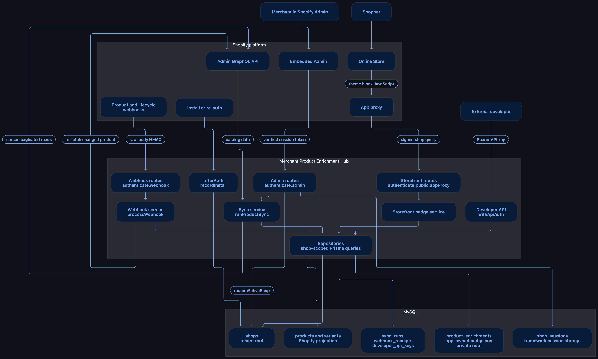

The same picture in compact form (Mermaid source, renders on GitHub):

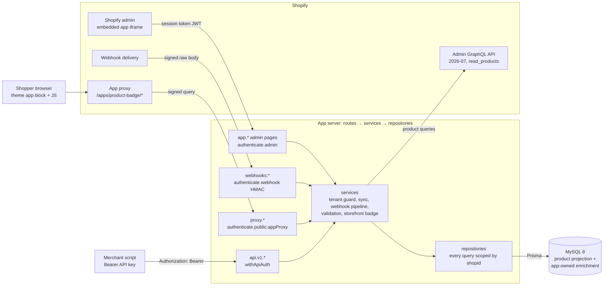

### Data ownership

- **Shopify is the source of truth for product data.** Title, handle, status, vendor, product type, variants and prices are only ever read from Shopify. The app's scope is `read_products`; it never writes to Shopify.
- **MySQL stores two different things.** `products` and `variants` are a local *projection* of Shopify's catalog: they can be rebuilt at any time by a sync, and a re-sync can only update rows because `(shopId, shopifyProductGid)` is unique. `product_enrichments` is *app-owned* data (badge text, badge colour, active flag, private internal note). The sync and the webhooks never write to `product_enrichments`, so enrichments survive every catalog refresh.
- Products are matched by shop and Shopify GID, never by title. Shopify GIDs are stored as strings; local autoincrement ids never leave the server through the API or the storefront.

### Security boundaries

There are four kinds of caller, and each has its own authenticator. They are kept separate on purpose: a credential that is valid at one boundary means nothing at another, and in every case the tenant is derived from the verified credential, never from a parameter the caller controls.

| Boundary | Caller | Proof | Tenant comes from |
|---|---|---|---|
| Admin session | Merchant inside Shopify admin | Session token (JWT) signed by Shopify, exchanged server-to-server for an access token (`authenticate.admin`) | `session.shop` → `requireActiveShop` |
| Webhook signature | Shopify | HMAC-SHA256 of the raw request body with the app secret (`authenticate.webhook`); 401 if wrong | The verified `webhook.shop`, never a payload field |
| API key | Merchant's scripts | `Authorization: Bearer eh_live_…`; only the SHA-256 hash is stored (`withApiAuth`) | The `developer_api_keys` row's shop; there is no `shop` parameter anywhere in the API |
| App-proxy signature | Shoppers, through Shopify | Shopify signs the forwarded query with the app secret (`authenticate.public.appProxy`); 400 if wrong | The signed `shop` parameter; changing it breaks the signature |

The app-proxy signature proves "Shopify forwarded this", not who the shopper is, so that path has its own serializer that selects only `badgeText`, `badgeColor` and `active`. `internalNote` is never loaded there. The developer API does return `internalNote` because the key holder is the merchant.

### Flows

**Install → authentication → local Shop row**

```text
Open app in admin → authenticate.admin → session token verified, exchanged for an access token
  → access token saved in shop_sessions (PrismaSessionStorage)
  → afterAuth hook → recordInstall (upsert) → shops row, uninstalledAt = null
Uninstall → app/uninstalled webhook → HMAC verified → recordUninstall
  → uninstalledAt set and sessions deleted in one transaction
```

`recordInstall` is an upsert, so a reinstall clears `uninstalledAt` on the same row. Every later request goes through `requireActiveShop`, which returns the local row or 403.

**Sync → Shopify GraphQL → Prisma upsert → MySQL**

```text
Sync now (admin button) or POST /api/v1/syncs
  → startSyncRun: row lock on the shop, refuse a second run, record RUNNING
  → GraphQL: one page of 25 products with 25 variants each; extra variant pages of 100 when needed
  → mapping + validation (GIDs, dates, Decimal prices)
  → one MySQL transaction per page: upsert products and variants + save counters and cursor
  → repeat until hasNextPage is false
  → mark products not seen in this run as deleted (deletedAt), record SUCCEEDED
```

API calls happen outside the transaction so no database lock is held while waiting on Shopify. The GraphQL client retries at most three times with backoff, waits on throttle metadata and has a 10-second request timeout inside a 60-second budget. A failed run keeps its committed pages and skips the deletion step; re-running is safe because upserts cannot duplicate.

**Webhook → HMAC verification → deduplication → MySQL update**

```text
POST /webhooks/products/update|delete
  → authenticate.webhook: raw body → HMAC check → 401 if wrong → parse JSON
  → processWebhook: shop row from the verified domain
      → claimReceipt: INSERT webhook_receipts (webhookId unique) → duplicate = 200, stop
      → update: re-fetch the product by id through the same GraphQL fields and mapping as the sync,
                upsert only if newer (row lock + updatedAtShopify comparison)
        delete: set deletedAt, keep variants and enrichment
      → receipt marked PROCESSED in the same transaction as the data change
  → error → receipt FAILED + 500, so Shopify retries with the same webhook id
```

The unique `webhookId` makes the database the idempotency boundary. A `FAILED` receipt, or a `RECEIVED` one older than 60 seconds, can be re-claimed atomically, so Shopify's retries can succeed while true duplicates are dropped.

**Theme block → app proxy → active badge → storefront**

```text
Product Badge app block (Liquid) → hidden container carrying product.id
  → deferred JS → fetch https://<shop>/apps/product-badge/products/<id>
  → Shopify app proxy adds shop + timestamp + signature → forwards to /proxy/products/:id
  → authenticate.public.appProxy → shop from the signed parameter
  → getStorefrontBadge: badge only if the product is ACTIVE, not deleted, and the enrichment is active
  → 200 { "badge": { text, color, textColor } } or { "badge": null }, Cache-Control: public, max-age=60
  → JS inserts the text with textContent and reveals the block
```

Every "nothing to show" case (unknown or uninstalled shop, bad id, draft or deleted product, no badge, inactive badge) returns the same `{ "badge": null }`, so the endpoint cannot be probed. The server picks black or white text for at least 4.5:1 contrast. A second block for product cards uses one batch request, `/apps/product-badge/badges?ids=…`, for up to 50 products.

---

## 2. Database documentation

MySQL 8, schema in [`db/schema.prisma`](../db/schema.prisma), SQL in `db/migrations/`. Prisma model names are PascalCase; `@@map` gives the snake_case table names below.

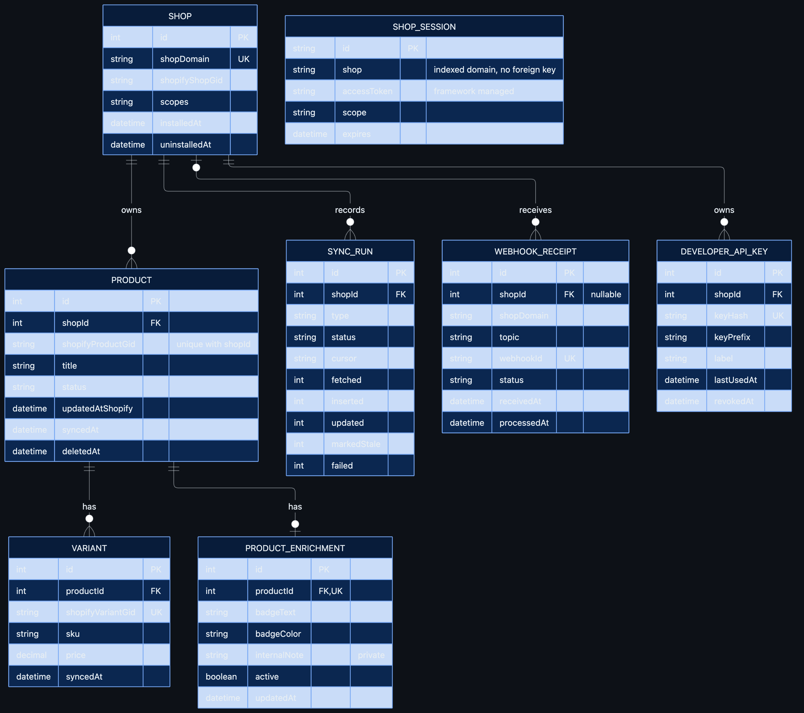

The same model with the real table names and every column (Mermaid source, renders on GitHub):

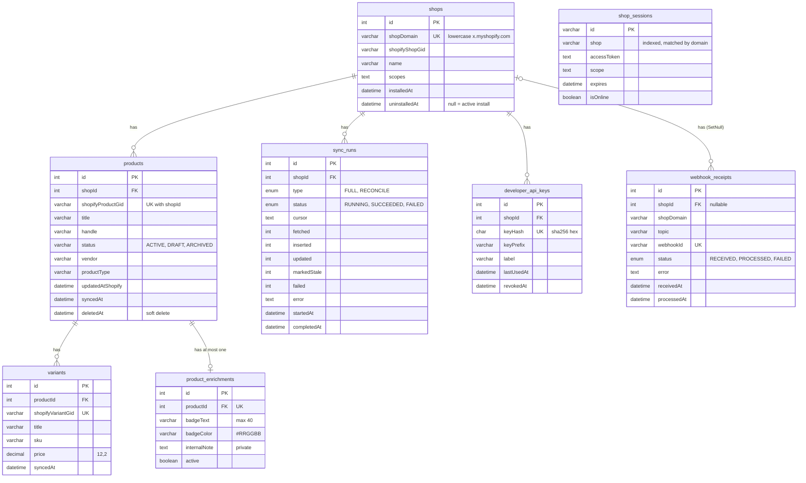

`shop_sessions` has no foreign key: it is managed by Shopify's `PrismaSessionStorage`, which addresses rows by shop domain, so its field names must stay exactly as the library expects.

### Tables

| Table | Purpose |
|---|---|
| `shops` | One local tenant per Shopify store. The root of all app data. `uninstalledAt = null` means installed; the row is kept on uninstall so history and reinstall stay simple |
| `shop_sessions` | Shopify framework session/token storage. `accessToken` is `TEXT` because MySQL's default `VARCHAR(191)` is too short for tokens. Rows are deleted on uninstall |
| `products` | Local copy of Shopify products. Shopify owns every field; the sync and webhooks refresh it |
| `variants` | Product variants. `price` is `DECIMAL(12,2)`, never a float. Cascade-deleted with their product row |
| `product_enrichments` | Badge text, badge colour, active flag and private internal note. App-owned; the sync never writes here |
| `webhook_receipts` | Webhook deduplication and status (`RECEIVED → PROCESSED / FAILED`) with a bounded error message for diagnosis |
| `sync_runs` | Sync progress and result: type, status, counters (fetched, inserted, updated, markedStale, failed), last saved cursor, error |
| `developer_api_keys` | Hashed external API keys: SHA-256 hash, a short prefix so the merchant can recognise a key, label, `lastUsedAt`, `revokedAt`. The plaintext is printed once and never stored |

### Important constraints

| Constraint | What it guarantees |
|---|---|
| `shops.shopDomain` is unique | One tenant per store. Domains are lowercased first, so `My-Store` and `my-store` are the same tenant |
| `(shopId, shopifyProductGid)` is unique on `products` | A re-sync or a repeated webhook can only update, never duplicate. Scoped by shop, so two shops cannot collide |
| `product_enrichments.productId` is unique | One enrichment per product, enforced by the database as well as by the upsert in code. A double click on Save updates the same row |
| `webhook_receipts.webhookId` is unique | A second insert of the same `X-Shopify-Webhook-Id` fails, so "have I seen this delivery?" is answered by the database rather than by a read-then-write two requests could both pass |
| `developer_api_keys.keyHash` is unique | The hash is the lookup value for authentication, and one key maps to exactly one shop |

Also: `variants.shopifyVariantGid` is unique; indexes `(shopId, title)` and `(shopId, status)` on `products`, `(shopId, status)` on `sync_runs` and `(shopId, topic)` on `webhook_receipts` all start with `shopId`, because every query is scoped to one shop.

### Soft delete

When a product is deleted in Shopify (a `products/delete` webhook, or a successful sync that no longer sees it), the local row is **not removed**. `products.deletedAt` is set instead. A hard delete would cascade to `product_enrichments` and silently destroy the merchant's badge and note, so keeping the row retains the enrichment history and an audit trail. Soft-deleted products are hidden from the admin list, return 404 from the developer API and `{ "badge": null }` on the storefront. If the product reappears in a later sync, `deletedAt` is cleared and its enrichment is still there. A late `products/update` for a deleted product re-fetches `null` from Shopify and is skipped, so it cannot resurrect the row.

---

## 3. API documentation

Base URL: the app URL (the tunnel URL printed by `shopify app dev`), prefix `/api/v1`.

### Authentication and tenancy

- **The caller sends a Bearer API key:** `Authorization: Bearer eh_live_…`. Keys are created with `npm run api-key -- create <shop-domain> "<label>"`, which prints the plaintext once; only its SHA-256 hash is stored.
- **The key identifies the shop.** `withApiAuth` hashes the key, finds the `developer_api_keys` row and takes the shop from that row. Revoked keys and keys of uninstalled shops are refused.
- **The shop is never accepted from the request body or query string.** There is no `shop` parameter anywhere in the API. Shop B's key asking for shop A's product gets the same 404 as a product that does not exist.
- Missing, malformed, unknown and revoked keys all return an identical 401 body, so a caller learns nothing from guessing.
- `{productId}` is the **numeric Shopify product id** (`8012345678901`), because a GID contains slashes. Responses always carry full GIDs (`gid://shopify/Product/8012345678901`). Local database ids never appear.

Every failure, including 405 and 500, uses one envelope, and every response carries an `X-Request-Id` header:

```json
{ "error": { "code": "validation_failed", "message": "Enrichment is not valid", "details": { "badgeColor": "…" }, "requestId": "…" } }
```

Rate limits: 60 requests/min per key, 5 sync starts/min per key, 20 failed logins/min per IP. A limited request gets 429 with `Retry-After`.

### Endpoints

| Method | Path | Purpose | Success | Common errors |
|---|---|---|---|---|
| GET | `/api/v1/products` | List the shop's products with their enrichment | 200 | 400, 401, 429 |
| GET | `/api/v1/products/{productId}` | One product with variants and enrichment | 200 | 400, 401, 404 |
| PUT | `/api/v1/products/{productId}/enrichment` | Create or replace the product's badge and note | 201 created / 200 updated | 400, 401, 404, 413, 422 |
| DELETE | `/api/v1/products/{productId}/enrichment` | Remove the enrichment (idempotent) | 204 | 401, 404 |
| POST | `/api/v1/syncs` | Start a catalog sync in the background | 202 + `Location` | 400, 401, 409, 429 |
| GET | `/api/v1/syncs/{id}` | Progress and result of a sync run | 200 | 400, 401, 404 |
| GET | `/api/v1/products/{productId}/images` | Shopify images a description generation may use | 200 | 401, 404, 409 |
| POST | `/api/v1/products/{productId}/description-generations` | Start an AI description generation in the background | 202 + `Location` (new) / 200 (same `Idempotency-Key`) | 400, 401, 404, 409, 413, 422, 429, 503 |
| GET | `/api/v1/products/{productId}/description-generations` | The product's generations, newest first (max 20) | 200 | 401, 404 |
| GET | `/api/v1/description-generations/{jobId}` | Status, draft, warnings, usage and error of one generation | 200 | 401, 404 |
| POST | `/api/v1/description-generations/{jobId}/regenerate` | New generation linked to a previous one | 202 + `Location` / 200 | 401, 404, 409, 422, 429, 503 |
| POST | `/api/v1/description-generations/batch` | Queue one generation per product (max 20); a worker runs them | 202 | 401, 404, 409, 422, 429, 503 |
| POST | `/api/v1/description-generations/{jobId}/apply` | Write the approved draft to Shopify | 201 | 401, 403, 404, 409, 422, 429, 502 |
| GET | `/api/v1/products/{productId}/description-versions` | Versions this app wrote, newest first | 200 | 401, 404 |
| POST | `/api/v1/products/{productId}/description-versions/{versionId}/restore` | Write an earlier version back | 201 | 401, 403, 404, 422, 429, 502 |
| GET | `/api/v1/products/{productId}/publish` | Sales channels with the product's state, publish history | 200 | 401, 403, 404, 502 |
| POST | `/api/v1/products/{productId}/publish` | Publish to one sales channel | 200 | 401, 403, 404, 409, 422, 429, 502 |

Machine-readable reference with schemas and examples: [openapi.yaml](openapi.yaml). Postman collection: [postman/enrichment-hub.postman_collection.json](postman/enrichment-hub.postman_collection.json).

#### GET /api/v1/products

Purpose: list the products of the key's shop, with each product's enrichment. Soft-deleted products are left out. Query parameters: `query` (title search), `status` (`ACTIVE`, `DRAFT`, `ARCHIVED`), `hasBadge` (`true`/`false`), `limit` (1–100), `cursor` (opaque token from the previous page).

```bash
curl -H "Authorization: Bearer $KEY" "$APP_URL/api/v1/products?status=ACTIVE&hasBadge=true&limit=20"
```

Body: none. Success **200**:

```json
{
  "data": [
    {
      "id": "gid://shopify/Product/8012345678901",
      "title": "Classic T-shirt",
      "handle": "classic-t-shirt",
      "status": "ACTIVE",
      "vendor": "Acme",
      "productType": "Shirts",
      "updatedAtShopify": "2026-09-19T11:21:12.000Z",
      "syncedAt": "2026-09-19T11:21:14.000Z",
      "enrichment": { "badgeText": "Staff Pick", "badgeColor": "#1A7F37", "active": true, "internalNote": "Reorder in March", "updatedAt": "2026-09-19T12:00:00.000Z" }
    }
  ],
  "pageInfo": { "hasNextPage": true, "nextCursor": "eyJpZCI6NDJ9" }
}
```

Common errors: **400** for an unknown `status`, a `limit` outside 1–100 or a malformed `cursor` (stricter than the admin page on purpose); **401** for a missing or invalid key.

#### GET /api/v1/products/{productId}

Purpose: one product with its variants and enrichment.

```bash
curl -H "Authorization: Bearer $KEY" "$APP_URL/api/v1/products/8012345678901"
```

Body: none. Success **200**: `{ "data": { …same product fields…, "variants": [ { "id": "gid://shopify/ProductVariant/44012345678901", "title": "Small", "sku": "TS-S", "price": "19.99" } ] } }`. `price` is a string so no precision is lost.

Common errors: **404** `product_not_found` when the product is unknown, soft-deleted or belongs to another shop; **400** when `{productId}` is not numeric; **401**.

#### PUT /api/v1/products/{productId}/enrichment

Purpose: create or replace the enrichment. The rules are the same module the admin editor uses, so the UI and the API cannot disagree.

```bash
curl -X PUT -H "Authorization: Bearer $KEY" -H "Content-Type: application/json" \
  -d '{"badgeText":"Staff Pick","badgeColor":"#1A7F37","active":true,"internalNote":"Reorder in March"}' \
  "$APP_URL/api/v1/products/8012345678901/enrichment"
```

Body:

```json
{ "badgeText": "Staff Pick", "badgeColor": "#1A7F37", "active": true, "internalNote": "Reorder in March" }
```

`badgeText` is required, at most 40 characters; `badgeColor` is `#RRGGBB` (stored uppercase); `active` hides the badge from the storefront while keeping it; `internalNote` is private.

Success: **201** when the enrichment was created, **200** when an existing one was updated. Response: `{ "data": { "badgeText", "badgeColor", "active", "internalNote", "updatedAt" } }`.

Common errors: **422** `validation_failed` with every field error listed in `details`; **400** for malformed JSON; **413** for an oversized body; **404** `product_not_found`; **401**.

#### DELETE /api/v1/products/{productId}/enrichment

Purpose: remove the enrichment. Idempotent: deleting one that does not exist is still a success.

```bash
curl -X DELETE -H "Authorization: Bearer $KEY" "$APP_URL/api/v1/products/8012345678901/enrichment"
```

Body: none. Success **204**, empty response. Common errors: **404** only when the product itself is unknown; **401**.

#### POST /api/v1/syncs

Purpose: start a catalog sync without a browser. The route obtains the shop's stored offline session first, creates the run, starts the sync without waiting for it, and returns immediately. The caller polls the `Location`.

```bash
curl -i -X POST -H "Authorization: Bearer $KEY" -H "Content-Type: application/json" \
  -d '{"type":"FULL"}' "$APP_URL/api/v1/syncs"
```

Body (optional, defaults to `FULL`):

```json
{ "type": "RECONCILE" }
```

Success **202** with header `Location: /api/v1/syncs/12`:

```json
{ "data": { "id": 12, "type": "FULL", "status": "RUNNING", "counts": { "fetched": 0, "inserted": 0, "updated": 0, "markedStale": 0, "failed": 0 }, "error": null, "startedAt": "2026-09-20T10:00:00.000Z", "completedAt": null } }
```

Common errors: **409** `sync_in_progress` when a run is already active for the shop, or `shop_session_unavailable` when the shop has no stored token; **400** `invalid_sync_type`; **429** above 5 starts/min; **401**.

#### GET /api/v1/syncs/{id}

Purpose: read the progress and result of a run. The run is looked up with the key's shop id, so another shop's run id is a 404. The internal Shopify page cursor is not returned.

```bash
curl -H "Authorization: Bearer $KEY" "$APP_URL/api/v1/syncs/12"
```

Body: none. Success **200**: the same shape as above, ending with `"status": "SUCCEEDED"` (or `FAILED` with `error` set) and `completedAt` filled in.

Common errors: **404** `sync_not_found`; **400** `invalid_sync_id` when the id is not a positive integer; **401**.

#### POST /api/v1/products/{productId}/description-generations

Purpose: ask a vision model for a product description. The call only creates a job; nothing is written to Shopify. Images are chosen by Shopify media id from `GET .../images`; an image URL is never accepted. `Idempotency-Key` (8-64 characters of `A-Z a-z 0-9 _ -`) is required: repeating a request with the same key returns the first job with **200** and makes no second model call.

```bash
curl -X POST -H "Authorization: Bearer $KEY" -H "Content-Type: application/json" \
  -H "Idempotency-Key: 4f0c2a9e-6f1d-4a57-9d55-2f6d6c1f0b11" \
  -d '{"mediaIds":["gid://shopify/MediaImage/34567890123"],"merchantContext":"For beginner skiers. Friendly tone.","model":null}' \
  "$APP_URL/api/v1/products/8123456789/description-generations"
```

Body: `mediaIds` (1-4 distinct `gid://shopify/MediaImage/<n>`, each a READY image of this product), `merchantContext` (optional, at most 2,000 characters), `model` (optional, must be in the server's allowlist). Success **202** with `Location: /api/v1/description-generations/{jobId}`:

```json
{ "data": { "id": 42, "status": "QUEUED", "reviewStatus": null, "previousGenerationId": null,
  "provider": "openrouter", "model": "nex-agi/nex-n2.5-mini:free", "promptVersion": "v1",
  "inputHash": "9f23...5f92",
  "input": { "mediaIds": ["gid://shopify/MediaImage/34567890123"], "merchantContext": "For beginner skiers. Friendly tone.", "imageCount": 1 },
  "draftHtml": null, "generated": null, "warnings": [], "usage": null, "error": null,
  "createdAt": "2026-09-21T16:48:48.468Z", "startedAt": null, "completedAt": null, "reviewedAt": null } }
```

Common errors: **422** `validation_failed` with `details` per field (`mediaIds`, `merchantContext`, `model`, `idempotencyKey`); **404** `product_not_found` (also for another shop's product); **429** `generation_limit_reached` (one running generation per shop, daily limit) or `rate_limited` (10 starts per minute per key); **409** `shop_session_unavailable`; **503** `ai_not_configured`; **413**; **401**.

#### GET /api/v1/description-generations/{jobId}

Purpose: poll a generation. The job is looked up with the key's shop id, so another shop's job id is a 404. The raw model answer and the product snapshot are never returned.

```bash
curl -H "Authorization: Bearer $KEY" "$APP_URL/api/v1/description-generations/42"
```

Success **200**, finished job:

```json
{ "data": { "id": 42, "status": "SUCCEEDED", "reviewStatus": "DRAFT", "...": "as above",
  "draftHtml": "<p>A warm beanie for cold days.</p><ul><li>Soft lining</li></ul>",
  "generated": { "descriptionHtml": "<p>A warm beanie for cold days.</p><ul><li>Soft lining</li></ul>",
    "shortDescription": "A warm beanie.", "seoTitle": "Blue Beanie", "seoDescription": "A warm blue beanie.",
    "highlights": ["Soft lining"], "warnings": [] },
  "warnings": ["Unverified performance claim: \"waterproof\""],
  "usage": { "promptTokens": 812, "completionTokens": 240, "estimatedCostUsd": 0, "latencyMs": 6400, "generationId": "gen-..." },
  "error": null } }
```

`status` is `QUEUED`, `RUNNING`, `SUCCEEDED` or `FAILED`. A failed job has `error` such as `INVALID_OUTPUT: Model output is not valid JSON. Model said: ...` or `RATE_LIMITED: OpenRouter returned 429`, and `draftHtml`, `generated` and `usage` are null. `draftHtml` is the merchant's working copy; `generated` stays as the model wrote it (after sanitizing).

Common errors: **404** `not_found`; **401**.

#### POST /api/v1/description-generations/{jobId}/regenerate

Purpose: try again without losing history. Always creates a NEW job whose `previousGenerationId` is `{jobId}`; the earlier job, its output and its usage are unchanged. The body is optional and overrides the previous attempt's `mediaIds`, `merchantContext` or `model`. `Idempotency-Key` is required.

```bash
curl -X POST -H "Authorization: Bearer $KEY" -H "Idempotency-Key: 0b7c1d52-91aa-4c1e-8d0a-6a2a3e1c9f00" \
  "$APP_URL/api/v1/description-generations/42/regenerate"
```

Success **202** (or **200** for a repeated key) with the new job. Common errors: **409** `invalid_state` while `{jobId}` is still running; **404**; **422**; **429**; **401**.

#### POST /api/v1/description-generations/{jobId}/apply

Purpose: write the APPROVED draft to Shopify with `productUpdate` (only `descriptionHtml`). The server re-reads the product first: a description changed since generation is refused. One version row is recorded with the text before and after; of two simultaneous calls exactly one writes.

```bash
curl -X POST -H "Authorization: Bearer $KEY" "$APP_URL/api/v1/description-generations/42/apply"
```

Success **201**:

```json
{ "data": { "id": 5, "generationId": 42, "source": "AI", "descriptionHtml": "<p>A merino beanie…</p>", "previousDescriptionHtml": "<p>Old text</p>", "restoredFromVersionId": null, "appliedBy": "api-key:eh_live_AbCd", "appliedAt": "2026-09-22T10:10:00.000Z", "shopifyUpdatedAt": "2026-09-22T10:09:59.000Z" } }
```

Common errors: **409** `invalid_state` (not approved, already applied, being applied) or `stale_product` (the job goes back to APPROVED with the reason and can be retried after a regeneration); **422** `shopify_rejected` with Shopify's `userErrors` keyed by field; **403** `missing_scope` when the shop has not granted `write_products`; **429** `shopify_throttled` with `Retry-After`; **502** `shopify_unavailable`; **404**; **401**.

#### GET /api/v1/products/{productId}/description-versions · POST …/{versionId}/restore

`GET` lists the versions this app wrote (newest first, max 20). `POST …/restore` writes an earlier version back through the same checks as Apply and appends a `RESTORE` row pointing at its source. Body optional: `{ "which": "written" }` (default, the text that version wrote) or `{ "which": "previous" }` (the text it replaced; on the oldest version that is the description before this app touched the product).

```bash
curl -X POST -H "Authorization: Bearer $KEY" -H "Content-Type: application/json" -d '{"which":"previous"}'   "$APP_URL/api/v1/products/8012345678901/description-versions/5/restore"
```

Success **201** with the new version (`source: "RESTORE"`, `restoredFromVersionId: 5`). Common errors: **404** (unknown, other shop, other product); **422** bad `which` or `shopify_rejected`; **403**; **502**; **401**.

#### GET / POST /api/v1/products/{productId}/publish

`GET` returns the shop's sales channels with the product's state on each and this app's publish history. `POST { "publicationId": "gid://shopify/Publication/11" }` publishes to that channel with `publishablePublish`. The product must be ACTIVE (a DRAFT product would be "published" but invisible, so it is refused with **409** before any call); the channel must be one of the shop's (**422** otherwise). Every attempt is an audited `publication_actions` row.

```bash
curl -H "Authorization: Bearer $KEY" "$APP_URL/api/v1/products/8012345678901/publish"
# { "data": { "productStatus": "ACTIVE", "publications": [ { "id": "gid://shopify/Publication/11", "name": "Online Store", "published": false } ], "history": [] } }
curl -X POST -H "Authorization: Bearer $KEY" -H "Content-Type: application/json" -d '{"publicationId":"gid://shopify/Publication/11"}'   "$APP_URL/api/v1/products/8012345678901/publish"
# { "data": { "actionId": 3, "publicationId": "gid://shopify/Publication/11" } }
```

Common errors: **409** `invalid_state` (product not ACTIVE); **422** `validation_failed` or `shopify_rejected` (the audit row is `FAILED` with the `userErrors`); **403** `missing_scope` (`write_publications`); **502**; **404**; **401**.

### Postman screenshots

Captured on 2026-09-20 against the real development store through the `shopify app dev` tunnel, authenticated with a Bearer API key (masked in Postman). The six requests form one round trip on the product "Gift Card" (`9494355902682`): read, add a badge, read it back, remove it, read again.

**1. `GET /api/v1/products` → 200 OK.** The synced catalog with full Shopify GIDs; products without a badge carry `"enrichment": null`.

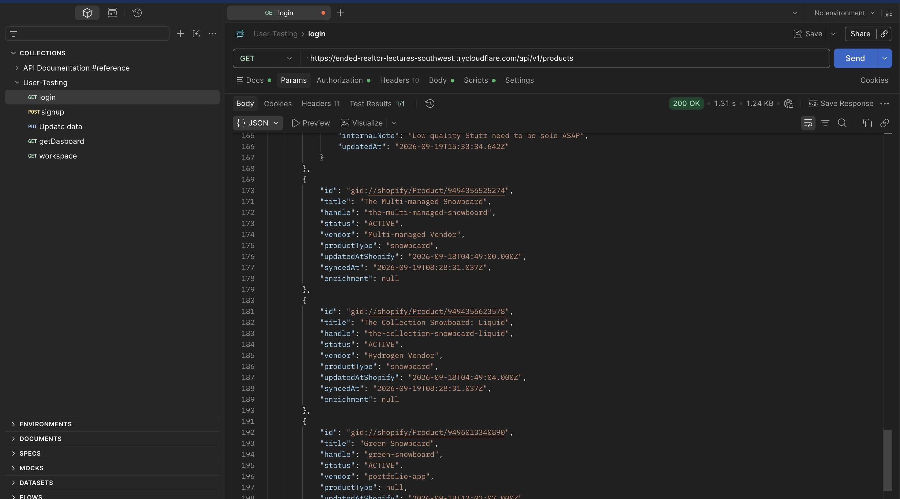

**2. `GET /api/v1/products/9494355902682` → 200 OK.** Bearer Token authorization; the product with its variants and no enrichment yet. Prices are strings.

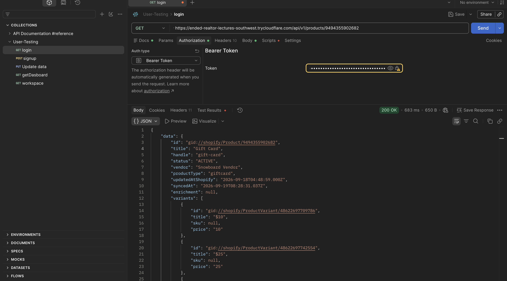

**3. `PUT /api/v1/products/9494355902682/enrichment` → 201 Created.** The JSON body creates the badge; the response returns the saved enrichment including `internalNote`.

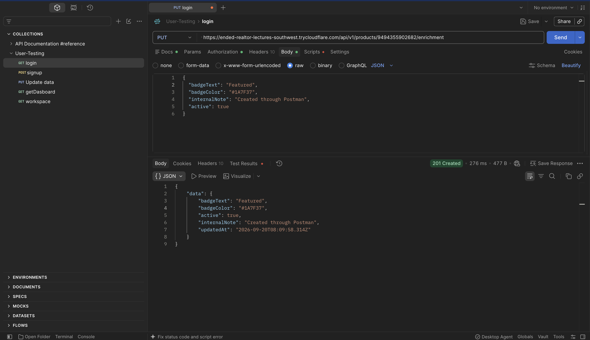

**4. `GET /api/v1/products/9494355902682` → 200 OK.** The same product now carries the enrichment written in step 3.

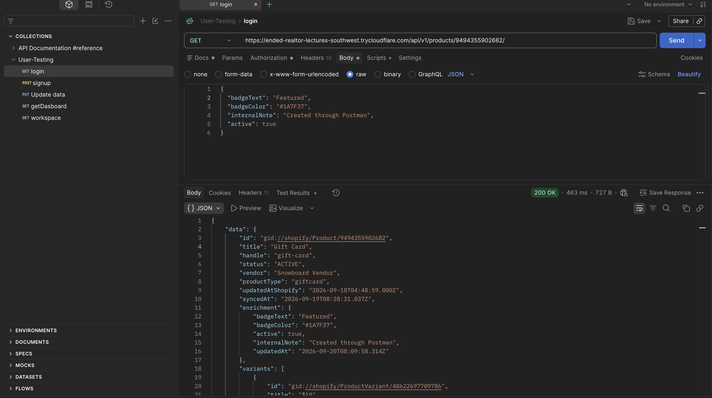

**5. `DELETE /api/v1/products/9494355902682/enrichment` → 204 No Content.** Empty response body.

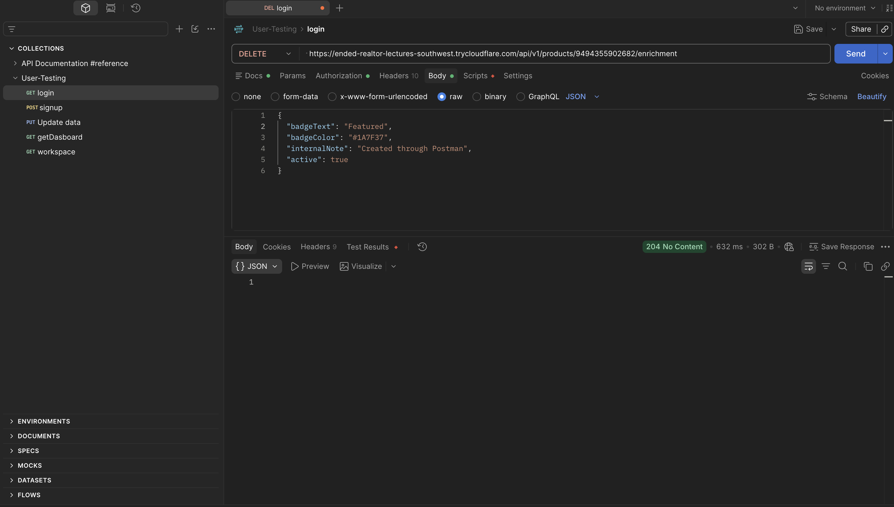

**6. `GET /api/v1/products/9494355902682` → 200 OK.** `"enrichment": null` again; the product and its variants are untouched.

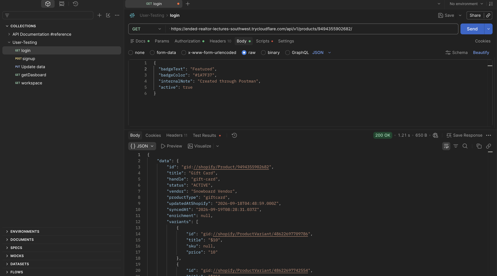

Not captured in Postman: `POST /api/v1/syncs`, `GET /api/v1/syncs/{id}` and the error responses (401, 404, 422, 409, 429). Those are covered by the 21 automated request tests on real MySQL listed in section 4.

---

## 4. Test evidence

### Automated commands

Run on 2026-09-22 against the working tree. All six pass.

| Command | Result |
|---|---|
| `npm test` | Pass. 12 test files, **127 tests passed** (Vitest) |
| `npm run test:integration` | Pass. 10 test files, **170 tests passed** against real local MySQL |
| `npm run typecheck` | Pass. `react-router typegen && tsc --noEmit`, no errors |
| `npm run lint` | Pass. ESLint, no errors or warnings |
| `npm run build` | Pass. Client and server bundles built (`build/server/index.js` 96.54 kB) |
| `npx shopify theme check --path extensions/product-badge` | Pass. 3 files inspected, **no offenses found** |

### What is real and what is mocked

- **Automated Shopify GraphQL calls are mocked.** No automated test contacts Shopify. The sync and webhook tests feed canned GraphQL responses (pages, cursors, throttle metadata, errors) into the real client, mapping and service code; the apply/publish tests use a small in-memory product store so `productUpdate` and `publishablePublish` effects can be asserted. Every query and mutation was validated against the `2026-07` schema with the Shopify AI Toolkit.
- **The model provider is mocked.** `OpenRouterClient` is an interface; tests inject a fake or a fake `fetch`. No automated test makes a billable call. Real OpenRouter calls were made only from the development store through the deployed app (Gemini 2.5 Flash, nex-n2.5-mini:free).
- **Automated database tests use real local MySQL.** `npm run test:integration` runs against the Docker MySQL 8 instance, in a separate database whose name must end in `_test`. It applies the real migrations, exercises real transactions, row locks and unique constraints, and deletes only the fixture shops it created. It never touches the development database.
- **Webhook and app-proxy signatures are tested using the real verification logic.** Route tests build requests signed with the app secret and send them through the framework's own `authenticate.webhook` and `authenticate.public.appProxy`. Valid, forged, tampered, unsigned and duplicate requests are covered: a forged webhook gets 401, a tampered or unsigned proxy request gets 400.
- **Manual installation, sync, API, webhook, and storefront checks use the real Shopify development store**, reached through the `shopify app dev` tunnel.

What the automated suites cover:

| Area | Unit (`npm test`) | Real MySQL (`npm run test:integration`) |
|---|---|---|
| Sync | Mapping validation, price preservation, cursor failure, error classification, bounded retries, throttle refill, deadlines | 60-product pagination, repeated imports, title updates, enrichment preserved, shop isolation, 130-variant pagination, rollback counts, deletion and revival, simultaneous starts, abandoned-run protection |
| Enrichment | Validation rules | One per product, tenant isolation, filters, keyset pagination |
| Webhooks | 13 tests: pipeline and status codes | 18 tests: receipts, duplicates, re-claim of `FAILED`, newer-than guard, real-HMAC route requests |
| Developer API | 5 tests | 21 request tests: auth failure, tenant scoping, valid write, invalid payload, missing product, rate limit, sync |
| Storefront | Contrast ≥4.5:1 over thousands of colours | 10 route tests with a real proxy signature: active badge, every empty case including cross-shop, tampered/unsigned, 429, batch endpoint |
| AI descriptions | Prompt boundary, schema validation, sanitizer (property test), claim detection, input hash, config, provider client (nine failure modes, no key in logs), state tables, mutation payload parsing, logger redaction, Shopify error mapping | Job idempotency and concurrency, limits, failure modes, request tests (401, other shop, oversized context, invalid media), apply (stale, double click, userErrors, transport, recovery, scope), restore, publish (scope, ACTIVE, audit), log content, admin rate limit |

### Manual checks on the development store

Status copied from the checklist in [VERIFICATION.md](VERIFICATION.md), which holds the full item list and the evidence. `[x]` verified · `[ ]` still open.

**Installation and tenancy: done**
- [x] App installs on the development store; `shops` row created by `afterAuth`; scope `read_products`; API version `2026-07` pinned in code and toml
- [x] `app/uninstalled` marks the shop uninstalled and deletes its sessions in one transaction

**Webhooks: partly done** (evidence read from the development database on 2026-09-19)
- [x] Real deliveries arrive through the public HTTPS tunnel; both product topics delivered
- [x] Product edited in Shopify Admin → local row updated with no sync run. Receipt #1 `PRODUCTS_UPDATE`, received 11:21:14.385, `PROCESSED` 11:21:14.956 (0.57s, inside Shopify's 5s limit)
- [x] Product deleted in Shopify → local row soft-deleted. Receipt #2 `PRODUCTS_DELETE`, `PROCESSED` in 14ms; the row and its 3 variants are still present with `deletedAt` set
- [ ] Same delivery twice live (covered by automated tests at service level and as a signed route request)
- [ ] Enrichment kept after a live delete of a product that has a badge (covered by an automated test)
- [ ] Safe failure → 500 + `FAILED`, then Shopify's retry → `PROCESSED`
- [ ] Uninstall and reinstall write lifecycle receipts
- [ ] Log lines reviewed for `webhook.processed` metadata and absence of payload or secrets

**Sync: open**
- [ ] With at least 20 test products, Sync now → `SUCCEEDED`, local product and variant counts match
- [ ] Sync again unchanged → 0 inserted; rename in Shopify → same local row, new title
- [ ] Product with more than 25 variants fully copied; deleted product soft-deleted; Reconcile recorded as `RECONCILE`

**Developer API: partly done** (evidence: the Postman captures in section 3, 2026-09-20)
- [x] `npm run api-key -- create <shop-domain> "<label>"` produced a working key (used as the Bearer token in every capture)
- [x] `GET /api/v1/products` → 200 with the synced products; `GET /api/v1/products/{productId}` → 200 with variants
- [x] `PUT …/enrichment` → 201, and the next `GET` returns the badge; `DELETE …/enrichment` → 204, and the next `GET` returns `"enrichment": null`
- [ ] The badge written through the API appears in the admin Products page
- [ ] No key or an invalid key → 401 envelope; revoke the key → 401
- [ ] `POST /api/v1/syncs` → 202, then `GET` the `Location` until `SUCCEEDED`

**Storefront: open**
- [ ] Theme editor → product template → Add block → Apps → **Product Badge**, no theme code edited; each setting changes the preview
- [ ] ACTIVE badge renders; INACTIVE and MISSING render nothing; response holds only `text`, `color`, `textColor`
- [ ] Opening `/proxy/products/<id>` directly, without a signature, returns 400

---

## 5. AI description generator

### Boundaries

Two things are new compared with sections 1–3: the app now calls a **model provider** (OpenRouter) and now **writes** to Shopify. Both sit behind explicit, audited boundaries.

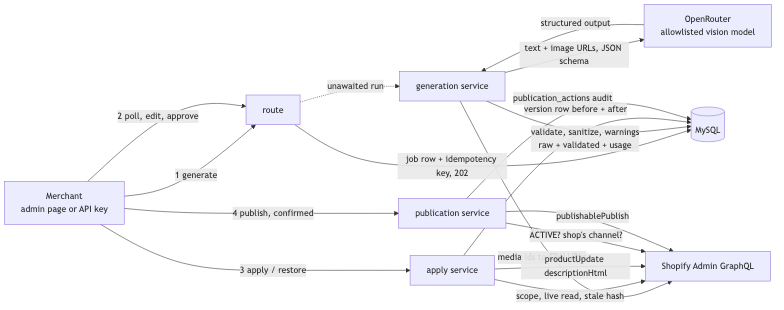

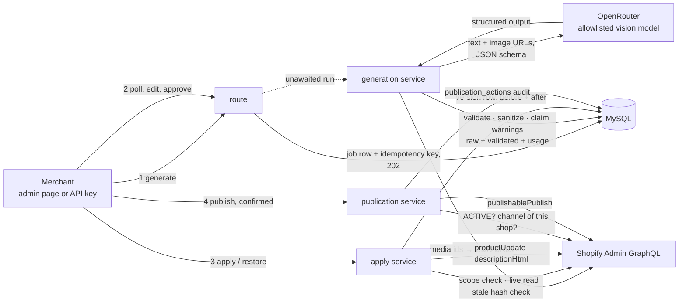

- **Untrusted in, validated out.** Product fields, merchant facts and image alt text enter the prompt as labelled data blocks; the model's answer is treated like a webhook body: JSON-schema validated, HTML-sanitized (allowlist, no attributes), scanned for unsupported claims, and shown to a person. Nothing reaches Shopify without Approve and a separate Apply confirmation.
- **No client-supplied URLs.** Images are chosen by Shopify media id; the server resolves them against the product and sends Shopify's CDN URLs. No image bytes are stored.
- **The write path is one function.** Apply and Restore share it: scope check → sanitize → live read and stale hash check → `productUpdate` outside any transaction → version row + state change in one transaction. `userErrors` are a 422 with field messages; transport failures leave the job retryable.
- **Publish is separate and explicit**: selected channel, ACTIVE product, `write_publications`, confirmation, audit row before and after the call.
- **Batches are rows, not promises.** A batch creates QUEUED jobs only; a worker loop in the web process leases them one per shop at a time (`FOR UPDATE SKIP LOCKED`) and runs the same generation code, so queued work survives restarts and the spend limits apply at run time.

### Data model additions

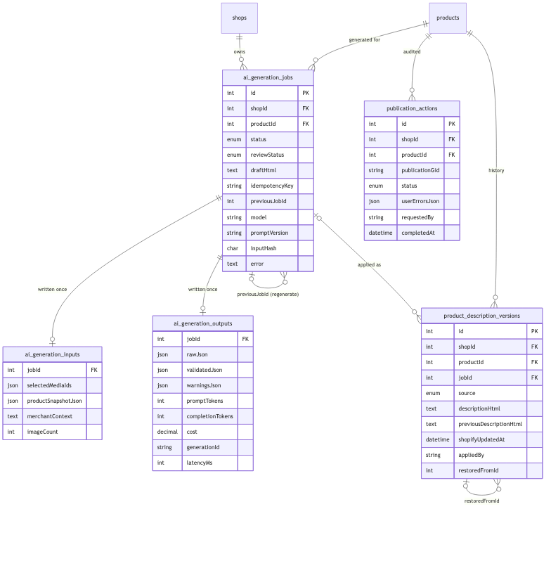

| Table | Role | Key constraints |
|---|---|---|
| `ai_generation_jobs` | One attempt; the only mutable row (`status`, `reviewStatus`, `draftHtml`, `error`) | unique `(shopId, idempotencyKey)`; FK product; `previousJobId` links regenerations |
| `ai_generation_inputs` | Exactly what was sent: media ids, product snapshot (incl. description hash and `updatedAt`), merchant context. Write-once | 1:1 job |
| `ai_generation_outputs` | Raw and validated JSON, warnings, tokens, cost, generation id, latency. Write-once | 1:1 job |
| `product_description_versions` | Append-only history of every write: text before and after, Shopify `updatedAt`, actor, `restoredFromId` | index `(shopId, productId, appliedAt)` |
| `publication_actions` | Every publish attempt with Shopify's answer | index `(shopId, productId, requestedAt)` |

State: job `QUEUED → RUNNING → SUCCEEDED | FAILED`; review `DRAFT → APPROVED | REJECTED`, `APPROVED → APPLYING → APPLIED` (`APPLYING → APPROVED` on refusal). Diagrams in [DESIGN.md, section 7](DESIGN.md#7-ai-product-description-generator).

### Cost and privacy note

| Topic | Choice |
|---|---|
| Model | Allowlist in `OPENROUTER_MODELS`; each must accept images and structured outputs, and `provider.require_parameters: true` stops OpenRouter routing to an endpoint that ignores the schema. Router models are refused so the answering model is always known. Development used `google/gemini-2.5-flash` and `nex-agi/nex-n2.5-mini:free` |
| Provider routing and retention | `OPENROUTER_DATA_COLLECTION=deny` (default) restricts routing to providers that do not retain or train on prompts. Free endpoints usually require `allow`; that setting was used only with development-store data |
| What leaves the server | Product title, vendor, type, tags, current description text, merchant facts, and up to four Shopify CDN image URLs (1024 px). Never the internal note, API keys, or any customer data |
| What is stored | Snapshot, context, raw and validated output, usage. Never image bytes or the provider key. `raw_json` can be dropped later without affecting the workflow |
| Token limits | `AI_MAX_OUTPUT_TOKENS` 4000; context ≤ 2000 characters; description HTML ≤ 10,000 characters; ≤ 4 images |
| Spend limits | 1 concurrent and 50 generations per shop per 24 h, counted from rows; 10 starts/min per key or shop |
| Measured cost | Every job stores `promptTokens`, `completionTokens`, `cost` (USD, from OpenRouter's usage accounting) and `latencyMs`, shown on the page. Gemini 2.5 Flash with two images: about 1,100–1,400 prompt tokens, 200–300 completion tokens, **$0.001–0.003 per generation**, 4–8 s. Free models: $0, but daily caps produce `RATE_LIMITED` failures |

### Tool disclosure

Built with Claude Code (Anthropic) as a pair-programming assistant: it drafted code, tests and documentation after the approach for each step was discussed and decided by the author; every change was reviewed and the five checks run locally. The Shopify AI Toolkit validated every GraphQL query and mutation against the `2026-07` schema. No generated code was accepted without tests.

### Time spent

| Work | Budget | Actual |
|---|---|---|
| Design and threat model | 1.5 h | 1.5 h |
| Database and service skeleton | 2.5 h | 2.0 h |
| Multimodal generation | 3.5 h | 3.5 h |
| Merchant workflow | 3.0 h | 3.0 h |
| Shopify write, publish, restore | 3.0 h | 3.0 h |
| Security and reliability | 2.0 h | 1.5 h |
| Tests and documentation | 2.5 h | 2.0 h |
| **Total** | **18 h** | **16.5 h** |

Not done, with next step: move single generations, apply, sync and webhooks onto the same worker (today only batches are queued; the others run in the request process and are recovered by timeout); shared rate limiter; CI workflow.
